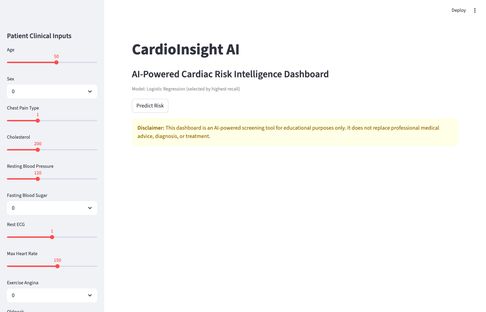
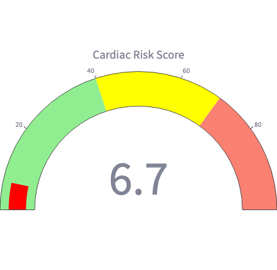
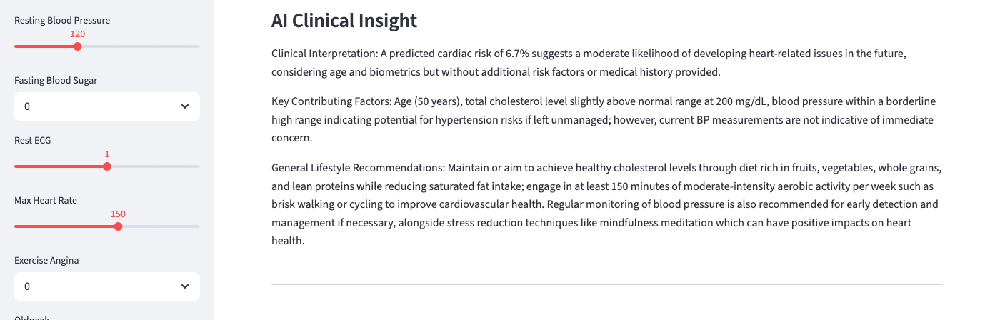
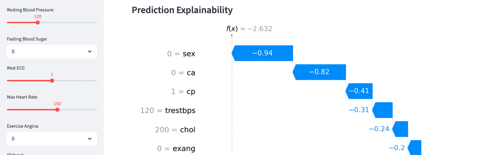

# CardioInsight AI

AI-powered cardiac risk intelligence dashboard integrating machine learning, explainable AI, and local LLM-generated clinical insights.

> **Note:** The deployed cloud version uses a lightweight static insight layer due to local Ollama runtime limitations on free cloud infrastructure. Full local version supports Ollama-based LLM clinical insight generation.

---

## Features

- Cardiac disease risk prediction
- Logistic Regression model comparison pipeline
- SHAP explainability visualizations
- Local LLM clinical insights using Ollama
- Interactive Streamlit dashboard
- PDF clinical report generation

---

## Architecture

```
Patient Inputs
      ↓
ML Prediction
      ↓
Explainability
      ↓
LLM Clinical Insights
      ↓
Dashboard Visualization
```

---

## Tech Stack

| Component       | Tool                |
|----------------|---------------------|
| Frontend        | Streamlit           |
| ML              | Scikit-learn        |
| Explainability  | SHAP                |
| LLM             | Ollama + Phi-3      |
| Visualization   | Plotly              |

---

## Screenshots

### Dashboard


### Gauge Chart


### AI Clinical Insight


### SHAP Explainability


---

## Setup

```bash
git clone https://github.com/your-username/cardioinsight-ai.git
cd cardioinsight-ai
python -m venv venv
source venv/bin/activate
pip install -r requirements.txt
```

Install and start Ollama with the Phi-3 model:

```bash
ollama pull phi3
ollama serve
```

---

## Usage

Train the model:

```bash
python train_model.py
```

Run the dashboard:

```bash
streamlit run app.py
```

---

## Project Structure

```
cardioinsight-ai/
│
├── app.py
├── train_model.py
├── requirements.txt
├── README.md
├── .gitignore
│
├── data/
│   └── heart.csv
│
├── models/
│   └── heart_model.pkl
│
└── screenshots/
```

---

## Future Improvements

- ECG integration
- Longitudinal patient monitoring
- Cloud-hosted inference
- EHR integration

---

> **Disclaimer:** This dashboard is an AI-powered screening tool for educational purposes only. It does not replace professional medical advice, diagnosis, or treatment.
